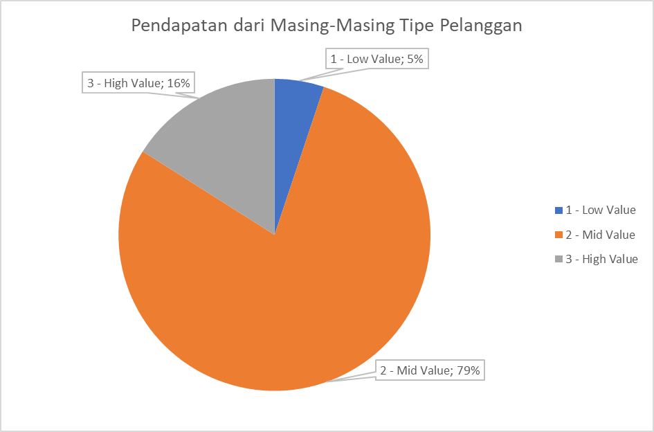
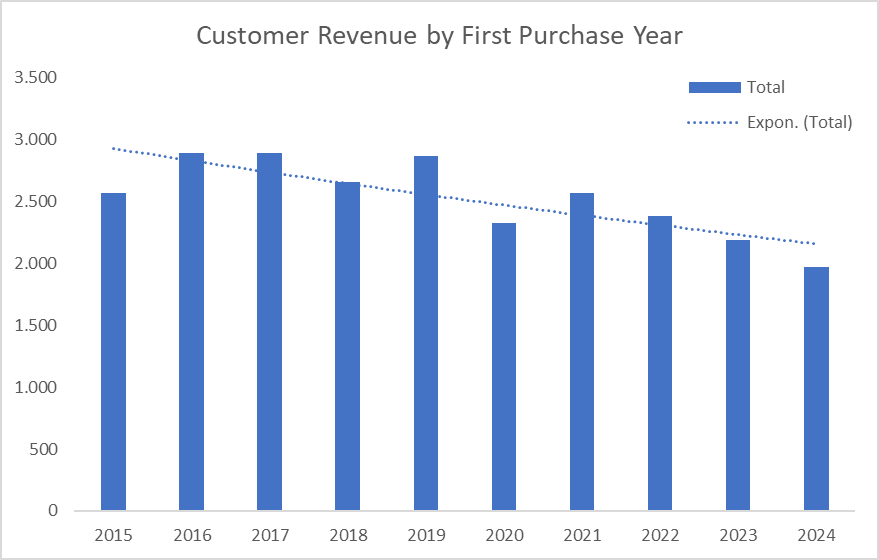
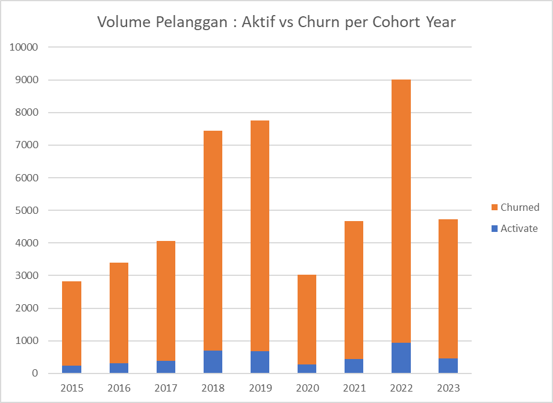

# INTERMEDIATE SQL - Sales Analysis
## OVERVIEW
Analisis perilaku pelanggan, retensi, dan nilai seumur hidup (lifetime value) untuk perusahaan e-commerce guna meningkatkan retensi pelanggan dan memaksimalkan pendapatan. Proyek ini juga merupakan kelanjutan dari proses pendalaman SQL saya, di mana saya mempelajari beberapa fungsi tambahan seperti window functions dan optimasi kueri.

## Business Questions
1. **Customer Segmentation**: Siapa pelanggan kita yang paling berharga?
2. **Cohort Analysis**: Bagaimana kelompok pelanggan yang berbeda menghasilkan pendapatan?
3. **Retention Analysis**: Pelanggan mana yang belum melakukan pembelian baru-baru ini?

## Analysis Approach

### 1. Customer Segmentation Analysis
- Mengategorikan pelanggan berdasarkan total lifetime value (LTV).
- Menetapkan pelanggan ke dalam segmen nilai Tinggi (High), Menengah (Mid), dan Rendah (Low).
- Menghitung metrik utama menggunakan total pendapatan (total revenue).

Query: [1_customer_segmentation.sql](./Scripts/1_customer_segmentation.sql)
 
**Visualization**

1. Visualisasi Distribusi Pelanggan

3. Visualisasi Pendapatan dari Masing-Masing Tipe Pelanggan

**Key Findings**
 
- **Low-Value Segment**: Mengisi 25% dari total customer (12,372 customer), namun hanya menyumbang 5% total revenue ($4,3M).
- **Mid-Value Segment**: Berisikan 50% dari total customer (24,743 customer), dan menyumbang jumlah revenue tertinggi yaitu 79% dari total revenue ($66,6M).
- **High-Value Segment**: Berisikan 25% dari total customer (12,372 customer), menyumbang 16% total revenue ($1,35M).

**Business Insight**
 
- **Low-Value Segment**: Buatkan campaign promosi khusus untuk meningkatkan minat belanja awal.
- **Mid-Value Segment**: Karena segmen ini memiliki tingkat kepercayaan tinggi, gunakan strategi **Up-Selling** dengan insentif *spending threshold* (misal: "Gratis ongkir jika belanja mencapai $100") untuk mengonversi mereka menjadi High-Value.
- **High-Value Segment**: Terapkan **VIP TIER / Loyalty Program** eksklusif seperti *early access* produk baru untuk menjaga loyalitas jangka panjang.

### 2. Cohort Analysis
- Melacak pendapatan dan jumlah pelanggan per kelompok berdasarkan tahun pembelian pertama.
- Menganalisis retensi pelanggan pada tingkat kelompok.

Query: [2_cohort_analysis.sql](./Scripts/2_cohort_analysis.sql)

**Visualization**

**Key Findings**
 
- Terdapat tren penurunan pendapatan yang konsisten dari pelanggan baru sejak tahun 2016 hingga 2024.
- Terjadi penurunan tajam dalam tiga tahun terakhir (2022-2024). Pada tahun 2024, pendapatan dari pelanggan baru berada di titik terendah (1.972), turun sekitar 32% dari masa puncaknya.

**Business Insight**
 
- **Evaluasi Strategi Marketing**: Penurunan akuisisi berkualitas menandakan perlunya audit total terhadap saluran pemasaran (iklan, media sosial, dll) karena cara lama sudah tidak efektif.

### 3. Retention Analysis
- Mengidentifikasi pelanggan yang berisiko berhenti belanja.
- Menganalisis pola pembelian terakhir dan metrik khusus pelanggan.

Query: [3_retention_analysis.sql](./Scripts/3_retention_analysis.sql)

**Visualization**

**Key Findings**
 
- Jumlah pelanggan berstatus **Churned** secara konsisten lebih besar daripada pelanggan **Active**, menunjukkan kemampuan akuisisi yang baik namun retensi yang lemah.
- Pola pada 4 cohort terakhir menunjukkan hasil yang serupa dengan tahun-tahun sebelumnya, menandakan perlunya intervensi strategis segera.

**Business Insight**
 
- Fokus pada strategi **Sustainable Growth**: Prioritaskan menjaga pelanggan yang sudah ada daripada hanya membakar budget untuk akuisisi baru.
- Ubah strategi promosi dari "diskon massal" menjadi penawaran berbasis nilai (*value-based*) untuk menarik pelanggan yang lebih loyal.

---

## Strategic Recommendations

**1. Pergeseran Fokus: Retensi > Akuisisi**
- Melakukan pivot strategi dari *aggressive growth* ke *sustainable growth* untuk mengatasi tingginya tingkat churn.
- Realokasi minimal 40% budget marketing ke dalam program loyalitas dan *Customer Lifecycle Management* (CLM).

**2. Proteksi dan Optimalisasi Segmen Mid-Value**
- Menjaga stabilitas segmen Mid-Value sebagai penyumbang 78,84% revenue utama perusahaan.
- Implementasi *spending threshold* untuk meningkatkan frekuensi transaksi.

**3. Kampanye Win-Back "High-Value" Customer**
- Prioritaskan kampanye reaktivasi tertarget (seperti voucher eksklusif) untuk pelanggan High-Value yang telah churn karena memiliki potensi ROI yang jauh lebih tinggi.

---

## Technical Details
- **Database:** PostgreSQL
- **Analysis Tools:** SQL
- **Visualization:** Excel / Power BI
