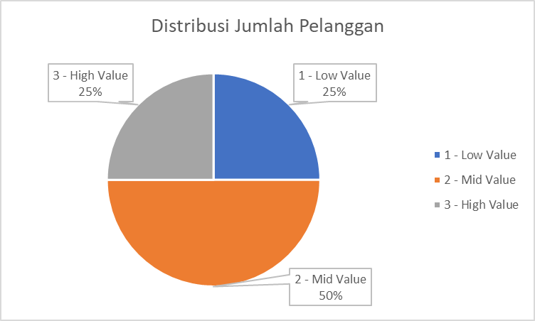

# INTERMEDIATE SQL - Sales Analysis
## OVERVIEW
Analisis perilaku pelanggan, retensi, dan nilai seumur hidup (lifetime value) untuk perusahaan e-commerce guna meningkatkan retensi pelanggan dan memaksimalkan pendapatan. Proyek ini juga merupakan kelanjutan dari proses pendalaman SQL saya, di mana saya mempelajari beberapa fungsi tambahan seperti window functions dan optimasi kueri.
## Business Questions
1. **Customer Segmentation**: Siapa pelanggan kita yang paling berharga?
2. **Cohort Analysis :** Bagaimana kelompok pelanggan yang berbeda menghasilkan pendapatan?
3. **Retention Analysis**: Pelanggan mana yang belum melakukan pembelian baru-baru ini?
## Analysis Approach
### 1. Customer Segmentation Analysis
- Mengategorikan pelanggan berdasarkan total lifetime value (LTV).
- Menetapkan pelanggan ke dalam segmen nilai Tinggi (High), Menengah (Mid), dan Rendah (Low).
- Menghitung metrik utama menggunakan total pendapatan (total revenue).

Querry : [1.customer_segmentation.sql](Scripts\1_customer_segmentation.sql)

**Visualization**
 
1. Visualisasi Distribusi Pelanggan

2. Visualisasi Pendapatan dari Masing-Masing Tipe Pelanggan

**Key Findings**
 
- Low-Value Segment terisi 25% dari total customer, yaitu 12,372 customer, namun hanya membawa 5% total revenue ($4,3M)
- Mid-Value Segment Berisikan 50% dari total Customer, yaitu 24,743 customer, dan membawa jumlah revenue tertinggi yaitu 79% dari total revenue ($66,6M)
- High-Value Segment berisikan 25% dari total customer, yaitu 12,372 customer, namun membawa lebih banyak revenue dibandingkan dengan Low-Value Segment dengan revenue sebesar 16% ($1,35M)

**Business Insight**
 
- Untuk Low-Value Segment : Buatkan suatu campaign yang berisikan suatu promosi agar bisa meningkatkan minat belanja customer.
- Untuk Mid-Value Segment : Dengan tingginya revenue perusahaan berasal dari kategori ini, menandakan bahwa customer sudah percaya pada produk Perusahaan. Perusahaan bisa menggunakan Campaign Up-Selling, dengan memberikan insentif jika customer belanja hingga pada nilai belanja tertentu (misal: "Dapatkan gratis ongkir selamanya jika total belanja mencapai $100"). Dengan target mengonversi mereka menjadi High-Value Customer.
- Untuk High-Value Segment : Buatkan suatu **VIP TIER**/**Loyalty Program** yang bersifat eksklusif, seperti _early access_ untuk produk baru yang belum rilis. Dengan tujuan Menjaga loyalitas para customer terhadap perusahaan.

### 2. Cohort Analysis
- Melacak Pendapatan dan Jumlah Pelanggan per kelompok
- Kelompok dikelompokkan berdasarkan tahun pembelian pertama
- Menganalisis retensi pelanggan pada tingkat kelompok

Querry : [2.cohort_analysis.sql](Scripts\2_cohort_analysis.sql)

**Visualization**

**Key Findings**
 
- Terdapat tren penurunan pendapatan yang konsisten dari pelanggan baru sejak tahun 2016 hingga tahun 2024.
- Terjadi penurunan yang cukup mengkhawatirkan dalam tiga tahun terakhir (2022-2024). Pada tahun 2024, pendapatan dari pelanggan baru berada di titik terendah (1.972), atau turun sekitar 32% dibandingkan masa puncaknya.

**Business Insight**
 
- Nilai yang diperoleh dari pelanggan semakin menurun dari waktu ke waktu dan perlu diselidiki lebih lanjut.
- **Evaluasi Strategi Marketing** : Penurunan pendapatan dari pelanggan baru menandakan bahwa cara perusahaan menarik orang baru sudah tidak seefektif dulu. Perlu ada audit terhadap saluran pemasaran (iklan, media sosial, dll).

###  3. Retention Analysis
- Mengidentifikasi pelanggan yang berisiko berhenti berlangganan
- Menganalisis pola pembelian terakhir
- Menghitung metrik khusus pelanggan

**Visualization**

**Key Findings**
 
- Secara keseluruhan total pelanggan dengan status Churned yang lebih besar dibandingkan dengan pelanggan dengan Status Activate, hal ini menandakan bahwa perusahaan bisa mendatangkan pelanggan baru, namun tidak bisa mempertahankan mereka.
- Dilihat dari 4 cohort terakhir, memiliki pattern yang serupa dengan cohort sebelumnya, menandakan bahwa tanpa adanya tindakan baru, cohort kedepan akan memberikan hasil yang serupa.

**Business Insight**
 
- Berhenti memprioritaskan akuisisi pelanggan baru dan mulai fokus pada program loyalitas untuk menjaga pelanggan yang sudah ada.
- Strategi promosi harus diubah dari "diskon massal" menjadi penawaran berbasis nilai untuk menarik pelanggan berkualitas tinggi.
- Fokuskan strategi pada kampanye win-back yang tertarget bagi pelanggan High-Value yang telah churn. Mengaktifkan kembali pelanggan bernilai tinggi jauh lebih efisien dan menghasilkan ROI yang lebih besar dibandingkan upaya retensi yang bersifat umum.

## Strategic Recommendations

**1. Pergeseran Fokus: Retensi > Akuisisi**
 
- Beralih dari aggressive growth ke sustainable growth guna mengatasi tingginya tingkat churn di hampir seluruh cohort.
- Realokasi minimal 40% budget pemasaran dari akuisisi pelanggan baru ke program loyalitas dan Customer Lifecycle Management (CLM).

**2. Proteksi dan Optimalisasi Segmen Mid-Value**
 
- Fokus pada stabilitas segmen Mid-Value ($78,84\%$ revenue) guna menjaga kesehatan finansial perusahaan dari risiko churn.
- Implementasi spending threshold (seperti gratis ongkir atau poin ganda) untuk meningkatkan frekuensi transaksi dan mendorong konversi ke segmen High-Value.

**3. Kampanye Win-Back "High-Value" Customer**
 
- Prioritaskan kampanye reaktivasi (seperti voucher eksklusif) khusus untuk segmen High-Value yang sudah churn atau terdeteksi tidak aktif. 

## Technical Details
- **Database :** PostgreSQL
- **Analysis Tools :** PostgreSQL
- **Visualization :** EXCEL 